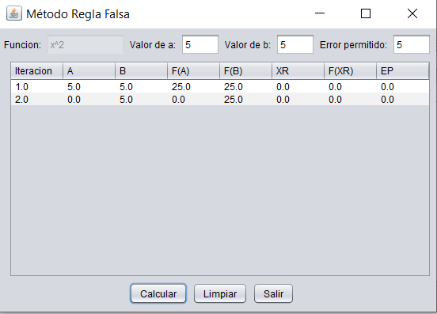

# Graphing and calculating numerical methods

Numerical methods are applications of algorithms by which it is possible to formulate and solve mathematical problems using less complex arithmetic operations. They are also known as indirect methods. Numerical analysis idealizes and devises methods for efficiently "approving" solutions to mathematically expressed problems. The main goal of numerical analysis is to find "approximate" solutions to complex problems.

This program was developed for a class project of the Numerical Methods course which consists of replicating each method seen in class throughout the semester through code to reinforce what has been learned.

Given a given function it shows its graph and from the given function it applies each numerical method available in the program.

## Libraries

The libraries used to interpret the functions and display their graphs are as follows

- jcommon
- jep-java
- jfreechart
- jmathplot
 
Features:

### Bisection method 

### False rule method

### Fixed-point method

### Newthon-Rhapson method

### Secant method

### Linear regression method

If you wish to support my content it would be super appreciated a help from you!

